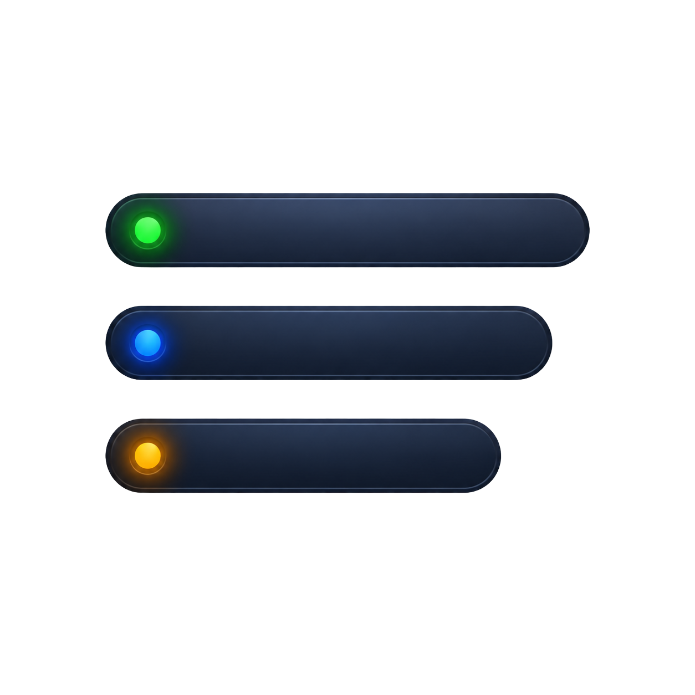

<p align="center">
  
</p>

<h1 align="center">BuildBar</h1>

<p align="center">
  <strong>The macOS menu bar cockpit for mobile & frontend engineers.</strong><br/>
  EAS Builds &middot; Vercel Deployments &middot; GitHub Actions — all in one dropdown.
</p>

<p align="center">
  
  
  
</p>

<p align="center">
  <a href="https://github.com/elgamlwork/BuildBar/releases/latest"><strong>↓ Download the latest release</strong></a>
  &middot;
  <a href="#install"><strong>Install options</strong></a>
  &middot;
  <a href="#first-launch-gatekeeper"><strong>First launch</strong></a>
</p>

---

## Why BuildBar

You ship Expo apps and Next.js frontends. That means you're constantly switching between:

- **expo.dev** to check EAS build status
- **vercel.com** to see if the latest deploy landed
- **GitHub Actions** to watch CI

BuildBar puts all three in your menu bar. One click, no browser tabs, no context-switching. It polls quietly in the background and sends you a native macOS notification the moment something changes.

---

## Tabs

### EAS Builds

Live dashboard for every Expo project you add.

- Multi-project — add as many folders as you ship from. Each gets a project-color chip.
- Live status badges with elapsed time (`Building · 4m 12s`)
- Filter by platform (iOS / Android), status (Building / Done / Failed), or free-text search
- Group by project or view as a flat chronological feed
- Rich per-build actions from the `···` menu or right-click:

  | Action | Detail |
  |--------|--------|
  | Copy install URL | One click to clipboard |
  | Show QR code | Scan and install on device |
  | Download artifact | Downloads and reveals in Finder |
  | Install via adb | Downloads APK and runs `adb install` |
  | View logs | Opens the build page on expo.dev |
  | Copy commit hash | Copies the full git hash |
  | Open commit on GitHub | Resolves the remote URL and opens the commit |
  | Cancel build | Cancels an in-flight EAS build |

- **EAS Updates** viewer — right-click a project → "View latest updates" to inspect published update branches and channels
- Auth-expired banner when `eas login` is needed

### Vercel

Deployment monitoring via the [Vercel REST API](https://vercel.com/docs/rest-api).

- See your last 15 deployments across personal and team accounts
- Filter by name, branch, target, commit message, or author
- Click to open the deployment URL or the Vercel inspector
- **One-time setup** — paste a personal access token (create one at [vercel.com/account/tokens](https://vercel.com/account/tokens))

### GitHub Actions

Workflow run monitoring via the `gh` CLI.

- Add `owner/repo` pairs — uses your existing `gh` auth, no token to manage
- Workflow name, branch, event type, status, and conclusion
- Click to open the run on GitHub
- Native notification when a workflow passes or fails

---

## Shared Features

| Feature | Detail |
|---------|--------|
| Native notifications | Build finished, deploy ready, workflow passed/failed — click the notification to open the URL |
| Disk cache | Menu opens instantly with cached data while a background refresh runs |
| Exponential backoff | When every project fails, polling slows down so you don't hammer APIs |
| Pause polling | Footer button to pause/resume polling per tab |
| Configurable interval | EAS tab: 15s / 30s / 1m / 5m |
| Launch at login | Gear menu → toggle on (requires `.app` bundle) |
| Per-project colors | 10-color palette per project and repo so chips are scannable |
| Rename projects | Right-click → Rename, or change the color tag |

---

## Requirements

- **macOS 13** (Ventura) or later
- **Xcode** — full install, not just Command Line Tools (SwiftUI needs the framework bundle)
- **EAS tab**: [`eas-cli`](https://github.com/expo/eas-cli) installed globally and logged in
  ```bash
  npm i -g eas-cli && eas login
  ```
- **Actions tab**: [GitHub CLI](https://cli.github.com) installed and authenticated
  ```bash
  brew install gh && gh auth login
  ```
- **Vercel tab**: A [personal access token](https://vercel.com/account/tokens) with "Full Account" scope

---

## Install

Pick whichever you prefer — all three install the same universal (Apple Silicon + Intel) build.

### DMG (recommended)

1. Download `BuildBar-x.y.z.dmg` from the [latest release](https://github.com/elgamlwork/BuildBar/releases/latest).
2. Open the DMG and drag **BuildBar** to the **Applications** shortcut.
3. See [First launch](#first-launch-gatekeeper) below — macOS will block the first open.

### .pkg installer

1. Download `BuildBar-x.y.z.pkg` from the [latest release](https://github.com/elgamlwork/BuildBar/releases/latest).
2. Double-click and follow the installer — it puts `BuildBar.app` in `/Applications`.
3. See [First launch](#first-launch-gatekeeper) below — macOS still gates unsigned `.pkg` installs the first time.

### Homebrew

A personal tap is the simplest distribution path until the app is notarized:

```bash
brew tap elgamlwork/buildbar
brew install --cask buildbar
```

> **Maintainer note:** the cask formula lives at [`Casks/buildbar.rb`](Casks/buildbar.rb). To wire up the tap, create a public repo named **`homebrew-buildbar`** under `elgamlwork/`, copy that file in, and push. Users will then be able to `brew install --cask buildbar`. Each release, bump the `version` in the formula — `livecheck` will keep `brew upgrade` working.

### From source

```bash
git clone https://github.com/elgamlwork/BuildBar.git
cd BuildBar
./run.sh             # debug build, wraps in .app, launches
./run.sh release     # release (optimized) build
```

> **Why `run.sh` instead of `swift run`?** macOS notifications and Launch at Login require a real `.app` bundle with a bundle identifier. `swift run` launches the raw binary from `.build/debug/` — no bundle, no notifications. `run.sh` builds the binary, wraps it in a proper `BuildBar.app` with icons and `Info.plist`, and `open`s it.

---

## First launch (Gatekeeper)

BuildBar releases are **not code-signed or notarized** (no Apple Developer ID yet). The first time you open the app, macOS will say something like *"BuildBar can't be opened because Apple cannot check it for malicious software"*. This is expected — bypass it once and you'll never see it again:

1. Open **Finder → Applications**.
2. **Right-click** (or Control-click) **BuildBar** and choose **Open**.
3. In the dialog, click **Open**.

You only do this once. After the first launch, double-clicking works normally.

A hammer icon appears in your menu bar. Click it, switch between tabs, and add your projects / token / repos. Open the gear menu and toggle **Launch at login** to start BuildBar automatically on reboot.

---

## Architecture

```
Sources/BuildBar/
├── App.swift                 @main entry point + AppDelegate (notifications, .accessory activation)
├── Models.swift              EASBuild, Project, ProjectColor, AnnotatedBuild, CacheSnapshot
├── EASService.swift          Shells out to `eas build:list --json`
├── EASUpdate.swift           EAS Updates model + popover
├── Watcher.swift             EAS polling engine, disk cache, exponential backoff, tick timer
├── Actions.swift             Shell helpers: cancel build, download artifact, adb install, git remote
├── Vercel.swift              Vercel REST API client + VercelWatcher
├── VercelView.swift          Vercel tab UI
├── GitHubActions.swift       `gh` CLI client + GitHubWatcher
├── GitHubActionsView.swift   Actions tab UI
├── LaunchAtLogin.swift       SMAppService wrapper
├── QRCodeView.swift          CoreImage QR code generator
└── Views.swift               Main menu UI, tab bar, project list, build rows, filter chips
```

Each tab runs an independent polling loop. Pollers sleep when paused. The EAS poller applies exponential backoff (up to 16× base interval) when every project returns an error — no retry storms.

---

## Maintainer: cutting a release

Releases are automated by [`.github/workflows/release.yml`](.github/workflows/release.yml). Pushing a `v*` tag builds a universal `.app`, packages it as both `.dmg` and `.pkg`, and publishes a GitHub Release with checksums:

```bash
git tag v0.2.0
git push origin v0.2.0
```

To build artifacts locally:

```bash
./create-dmg.sh           # Uses latest git tag as version
./create-dmg.sh 0.2.0     # Or specify a version
# Produces: BuildBar-0.2.0.dmg + BuildBar-0.2.0.pkg
```

The DMG includes a drag-to-install shortcut to `/Applications`. The `.pkg` installs `BuildBar.app` to `/Applications` directly.

### Sign and Notarize (optional)

Skipping this is fine — users get the first-launch warning described above. To remove that warning entirely you need an Apple Developer ID ($99/yr):

```bash
# Build the .app
./run.sh release

# Sign the .app with your Developer ID
security find-identity -v -p codesigning
codesign --force --deep --options runtime --timestamp \
  --sign "Developer ID Application: Your Name (TEAMID)" \
  BuildBar.app

# Package signed .app as DMG (--no-build skips rebuilding)
./create-dmg.sh --no-build 0.1.0

# Notarize the DMG
xcrun notarytool store-credentials "BuildBar-Notary" \
  --apple-id "you@example.com" \
  --team-id "TEAMID" \
  --password "abcd-efgh-ijkl-mnop"

xcrun notarytool submit BuildBar-0.1.0.dmg \
  --keychain-profile "BuildBar-Notary" \
  --wait

xcrun stapler staple BuildBar-0.1.0.dmg
```

---

## Troubleshooting

<details>
<summary><strong>command not found: eas / gh</strong></summary>

The app runs CLIs via a login shell (`zsh -l -c`), so it reads your `.zshrc` / `.zprofile`. Verify:

```bash
which eas   # should print a path
which gh    # should print a path
```

If you use Volta, asdf, or nvm for Node, make sure the init lines are in `.zprofile` (not `.zshrc`), since login shells read `.zprofile` first.
</details>

<details>
<summary><strong>No notifications</strong></summary>

On first launch, macOS prompts for notification permission. If you missed it: **System Settings → Notifications → BuildBar**. Notifications only work when launched from a `.app` bundle (via `run.sh`), never from raw `swift run`.
</details>

<details>
<summary><strong>Vercel says Unauthorized</strong></summary>

Token is expired or missing scopes. Create a new one at [vercel.com/account/tokens](https://vercel.com/account/tokens) with "Full Account" scope, then update it in the Vercel tab.
</details>

<details>
<summary><strong>GitHub Actions shows "Install GitHub CLI"</strong></summary>

```bash
brew install gh && gh auth login
```

Then click the refresh button in the Actions tab.
</details>

<details>
<summary><strong>Stuck on "Loading…" in EAS tab</strong></summary>

Run the command manually to see the real error:

```bash
cd /path/to/your/expo-project
eas build:list --json --non-interactive --limit=10
```
</details>

<details>
<summary><strong>Launch at login is greyed out</strong></summary>

You're running the raw binary via `swift run` (no bundle). Re-launch via `./run.sh`.
</details>

---

## License

MIT
